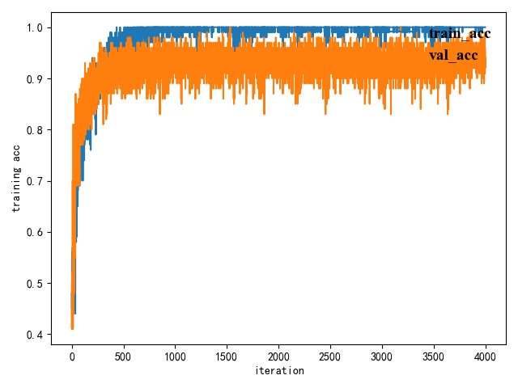
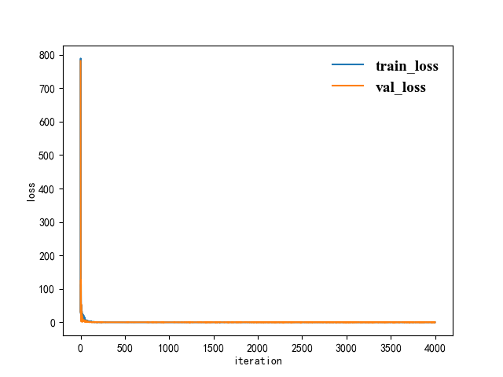

历史遗留项目整理

#改进的LeNet宫颈癌细胞识别项目
>* 一个简单的小外包
>* 属于二分类项目
>* 在LeNet的基础上加了三个残差块
>* 因为当初的图片数据太少，所以在image_deal中加入了一些简单数据增强方法(翻转、旋转、对比度、亮度、颜色等)
>* 图片的数据集找不到惹QAQ
>* excel数据还是有的，一个normal正常的宫颈细胞，另一个unnormal的宫颈细胞
###客户要求是某种算法的改进，故采用了LeNet，然后在第五层卷积之后加入了3个残差快，每个残差快中加入了两个卷积，一个标准化，一个relu，起名叫RALEX

训练过程见`ralex.txt`
---

